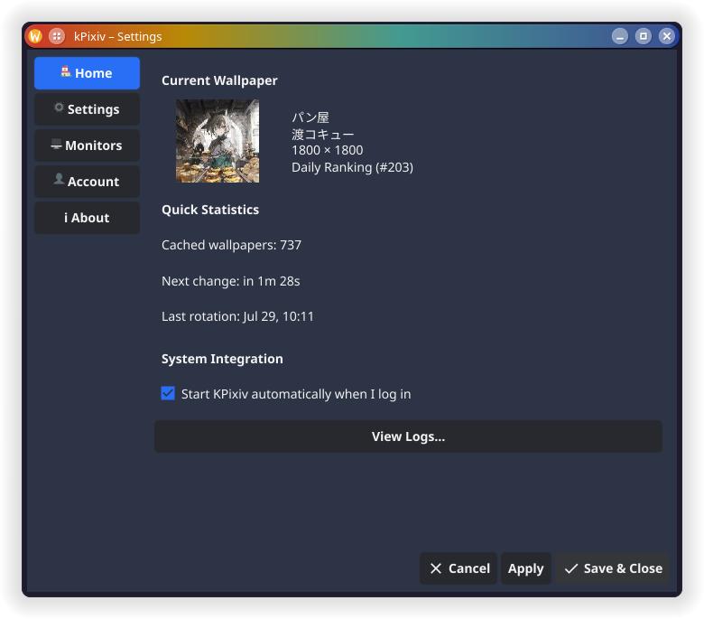
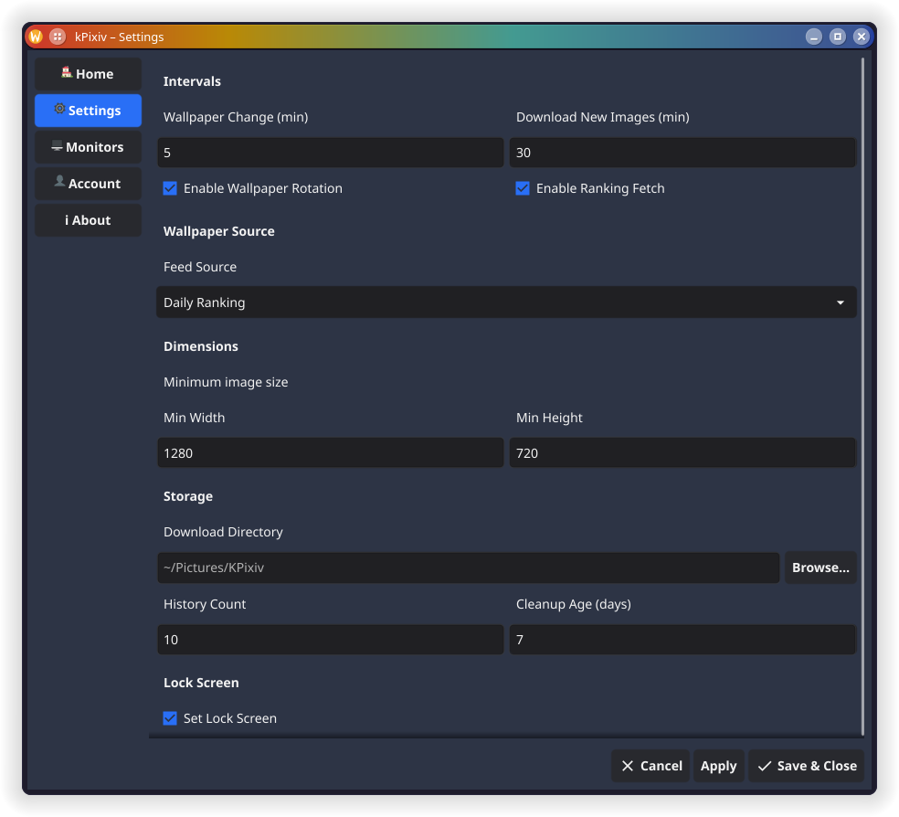
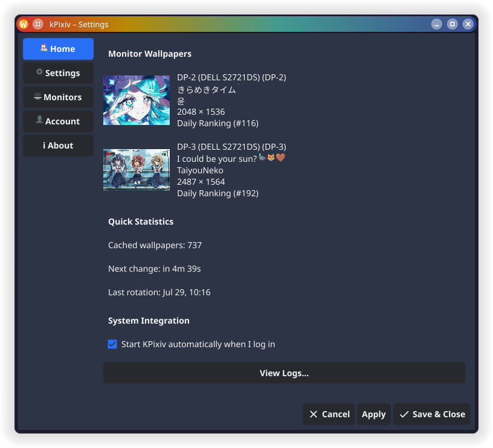
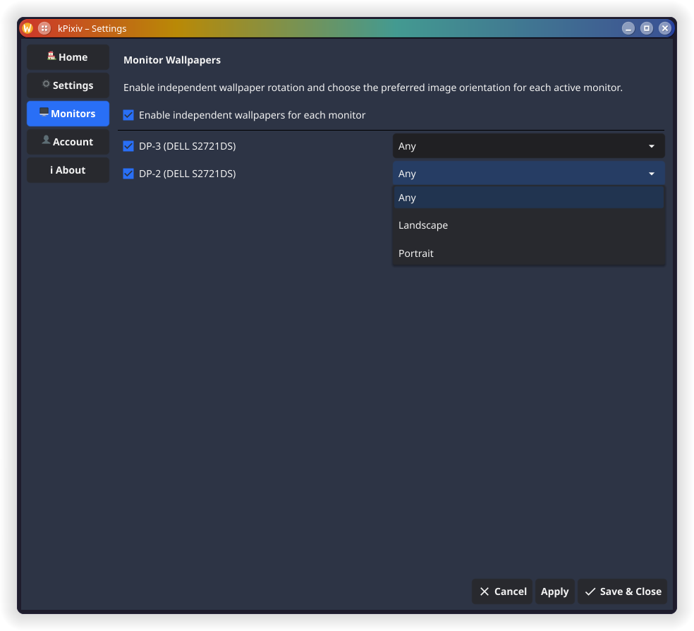

<div style="text-align: center">
  
  <h1>KPixiv</h1>
  <em>KDE Plasma–focused wallpaper manager for Pixiv.</em>
  <br>

  <a href="https://github.com/alphonse927/kpixiv/actions/workflows/ci.yaml"></a>
  <a href="https://github.com/alphonse927/kpixiv/releases"></a>
  <br><br>
  
</div>

## About

KPixiv turns Pixiv into a first-class wallpaper source on Linux. Instead of supporting dozens of generic providers, it focuses exclusively on Pixiv — fetching ranking feeds, managing local artwork, and applying wallpapers to your KDE Plasma desktop.

Designed to run unattended. Run it once, and it fetches wallpapers on a schedule, rotates them automatically, and keeps your screens looking fresh. Multi-monitor setups get independent wallpaper queues with per-screen orientation filters.

KPixiv ships as two binaries: a desktop daemon with tray and GUI (`kpixiv`), and a headless CLI (`kpixivctl`) for scripting.

## Disclaimer

kPixiv is an unofficial client for Pixiv.

This project is not affiliated with, endorsed by, or sponsored by Pixiv.

All artwork remains the property of its respective artists.
Users are responsible for complying with Pixiv's Terms of Service.

### Why kPixiv?

I created kPixiv because I switched to Arch Linux (KDE Plasma) and couldn't find a wallpaper rotator that fit the way I wanted to. 
This project started as a tool for my own desktop and continues to evolve based on my personal workflow. If it happens to be useful to others, even better.

## Quick Start

```bash
# Install from source
make install

# Or download a release
# https://github.com/alphonse927/kpixiv/releases
```

`make install` builds kPixiv, installs it to `~/.local`, and installs +
starts the systemd user service — kPixiv runs exclusively as a systemd user
service; see [Installation](#installation) for details and why.

For detailed installation options, see [Installation](#installation).

**Development:** use `make dev-install` instead — it symlinks the binaries so you don't need to rebuild on every change.

## Features

### Pixiv Integration

- Daily, weekly, and monthly ranking feeds
- OAuth login with automatic token refresh (browser-based PKCE flow)
- Original-resolution image downloads
- Bookmark artwork directly from the tray
- Periodic bookmark sync with automatic cleanup

### Wallpaper Management

- Automatic rotation on a configurable interval
- Download cache with the deduplication and age-based cleanup
- Favorites directory for keeping wallpapers you like
- Queue rebuilding from ranking images and/or bookmarks
- Dry-run mode for testing

### Multi-Monitor

- Per-monitor wallpaper assignment — each screen gets its own wallpaper
- Independent orientation filters (landscape, portrait, any) per monitor
- EDID-based monitor detection (shows connector name and model)
- Automatic queue recreation when monitor settings change

### Desktop Integration

- KDE Plasma–focused wallpaper manager
- Runs exclusively as a systemd user service — autostart on login and
  auto-restart on crash, with no separate "run it manually" mode to keep in
  sync (see [Installation](#installation))
- System tray with wallpaper controls
- GUI settings window (Home, Monitors, Settings, Account, About)
- In-app log viewer, reading kPixiv's own centralized log file
  (`~/.local/state/kpixiv/kpixiv.log`) rather than the systemd journal, so it
  works the same way whether kPixiv is running as the service or via
  `--foreground` for debugging

## Screenshots






## Requirements
- Linux
- KDE Plasma 6 (Only tested on Arch Linux with KDE Plasma 6.6.x)
- `qdbus`

## Installation

kPixiv runs exclusively as a **systemd user service** (`kpixiv.service`).
That's what gives it autostart on login and automatic restart if it ever
crashes. Running the `kpixiv` binary directly (a terminal, an app-menu
launcher) doesn't start a second, independent instance — it hands off to
the systemd-managed one, starting it if it isn't already running.

### Build from source

```bash
make install
```

This builds both binaries, installs them to `~/.local/bin`, registers the
`pixiv://` URL handler, and installs + starts the `kpixiv.service` systemd
user unit — no separate step needed.

For development, use `make dev-install` instead — it symlinks the build output so you can iterate without re-running the full install.

### Download a release

Download the latest tarball from the [Releases page](https://github.com/alphonse927/kpixiv/releases) and run:

```bash
tar xzf kpixiv-*.tar.gz
cd kpixiv-*/

mkdir -p ~/.local/bin
cp kpixiv kpixivctl ~/.local/bin/

# Install and start the systemd user service
kpixivctl autostart enable
```

The tarball doesn't run the Makefile's install steps, so `kpixivctl autostart enable` is what installs and starts `kpixiv.service` for this path.

### Managing the service

```bash
kpixivctl autostart enable   # install, enable on login, and start now
kpixivctl autostart disable  # stop now, and disable startup on login
kpixivctl status             # check whether it's running
```

The same toggle is available from Settings → "Run KPixiv in the background".

### Debugging without systemd

`kpixiv --foreground` runs the app directly in the current terminal instead
of handing off to the systemd service. There's no auto-restart and no
autostart integration in this mode — it's meant for local debugging, not
day-to-day use.

### Uninstall

```bash
make uninstall
```

This also stops and disables `kpixiv.service`.

## Configuration

Config file: `~/.config/kpixiv/config.yaml`

```yaml
download_path: "~/Pictures/KPixiv"

pixiv:
  ranking: "daily"
  r18: false
  min_width: 1280
  min_height: 720

wallpaper:
  mode: "fill"
  orientation: "any"
  history_limit: 10
  set_interval: 5
  fetch_interval: 30
  cleanup_days: 7
  multi_monitor_enabled: true
  monitors:
    "DP-1":
      rotation_enabled: true
      orientation: "landscape"
    "DP-2":
      rotation_enabled: true
      orientation: "portrait"

bookmarks:
  enabled: false
  sync_interval: 60
  auto_cleanup: true

kde:
  set_lock_screen: false
```

| Option                                       | Default             | Description                                               |
|----------------------------------------------|---------------------|-----------------------------------------------------------|
| `download_path`                              | `~/Pictures/KPixiv` | Where to store wallpapers                                 |
| `pixiv.ranking`                              | `daily`             | Ranking feed (`daily`/`weekly`/`monthly`)                 |
| `pixiv.r18`                                  | `false`             | Include R-18 content                                      |
| `pixiv.min_width` / `min_height`             | `1280` / `720`      | Minimum image dimensions                                  |
| `wallpaper.mode`                             | `fill`              | Scaling mode (`fill`/`cover`/`fit`)                       |
| `wallpaper.orientation`                      | `any`               | Single-monitor orientation (`any`/`landscape`/`portrait`) |
| `wallpaper.multi_monitor_enabled`            | `false`             | Enable per-monitor wallpaper assignment                   |
| `wallpaper.monitors.<conn>.rotation_enabled` | `true`              | Enable rotation for this monitor                          |
| `wallpaper.monitors.<conn>.orientation`      | `any`               | Orientation filter (`any`/`landscape`/`portrait`)         |
| `wallpaper.history_limit`                    | `10`                | Max wallpapers in rotation history                        |
| `wallpaper.set_interval`                     | `5`                 | Minutes between wallpaper changes                         |
| `wallpaper.fetch_interval`                   | `30`                | Minutes between Pixiv fetch cycles                        |
| `wallpaper.cleanup_days`                     | `7`                 | Remove cached wallpapers older than N days                |
| `bookmarks.enabled`                          | `false`             | Enable periodic bookmark sync                             |
| `bookmarks.sync_interval`                    | `60`                | Minutes between bookmark sync cycles                      |
| `bookmarks.auto_cleanup`                     | `true`              | Remove unbookmarked images from favorites                 |
| `kde.set_lock_screen`                        | `false`             | Also apply wallpaper to the lock screen                   |

Use `kpixivctl config set <key> <value>` to change settings from the command line.

## Usage

### Desktop

```bash
kpixiv
kpixiv --reset    # Clear all cached images before starting
```

The system tray provides:

```
Next Wallpaper              Switch to next queued wallpaper
Rotate Wallpaper            Toggle automatic rotation
---
Login to Pixiv / <user>    Authenticate or show connected user
Bookmark Current Artwork    Bookmark the current wallpaper on Pixiv
Logout from Pixiv           Clear session
---
Copy to Favorites           Save wallpaper to favorites directory
Open Current Artwork        Open the image file
Open Artwork in Pixiv       Open artwork page in browser
Exclude Current Wallpaper   Blacklist and skip
---
Settings                    Open configuration window
Quit                        Stop KPixiv
```

### CLI

Common commands:

```bash
kpixivctl wallpaper fetch               # Download wallpapers from Pixiv
kpixivctl wallpaper next                 # Apply next wallpaper in queue
kpixivctl wallpaper next --monitor DP-1  # Apply on a specific monitor
kpixivctl wallpaper next --all           # Apply on all monitors
kpixivctl account login                  # Log in to Pixiv
kpixivctl bookmarks sync                 # Sync bookmarked images
kpixivctl autostart enable               # Install, enable on login, and start now
kpixivctl autostart disable              # Stop now, and disable startup on login
kpixivctl status                         # Show full application status
kpixivctl doctor                         # Diagnose installation problems
kpixivctl cache stats                    # Show cache statistics
```

See `kpixivctl help` or the [full CLI reference](docs/cli.md) for all commands.

### Global flags

| Flag            | Description                                                   |
|-----------------|---------------------------------------------------------------|
| `-c, --config`  | Path to config file (default: `~/.config/kpixiv/config.yaml`) |
| `-v, --verbose` | Enable verbose logging                                        |
| `--dry-run`     | Show actions without downloading or applying                  |
| `--foreground`  | `kpixiv` only, advanced: run in this terminal instead of the systemd service (debugging) |

### Settings window

The Settings window provides tabbed configuration:

- **Home** — live status with thumbnail preview
- **Monitors** — enable multi-monitor, set per-screen rotation and orientation
- **Settings** — configure intervals, feed source, dimensions, storage
- **Account** — Pixiv login/logout
- **About** — application info
- **View Logs** — tail kPixiv's own centralized log file in-app

The **"Run KPixiv in the background"** toggle enables/disables — and immediately starts/stops — the systemd user service.

## Pixiv Login

KPixiv uses Pixiv's OAuth PKCE flow. Tokens are persisted and automatically refreshed.

```bash
# CLI
kpixivctl account login
kpixivctl account status
kpixivctl account logout
```

From the desktop, use the tray menu or the Account tab in Settings.

## Favorites

The **Copy to Favorites** tray action saves the current wallpaper to `$HOME/Pictures/KPixiv/` or the configured download path. 
Favorites are excluded from automatic cleanup.

## Bookmark Sync

When `bookmarks.enabled` is `true`, KPixiv periodically syncs your Pixiv bookmarks into the Favorites directory. Synced images are tagged as `bookmarks` in metadata and excluded from cleanup. When `auto_cleanup` is enabled, images that are no longer bookmarked are removed.

Manual sync: `kpixivctl bookmarks sync`

## Design Goals

- Focus exclusively on Pixiv as a wallpaper source
- KDE Plasma integration without compromises
- Lightweight Go application with minimal dependencies
- Scriptable through a complete CLI
- Reliable unattended operation via systemd
- Standard Linux technologies throughout

## Runtime Architecture

```
systemd user service -> kpixiv -> tray + scheduler + GUI
```

The desktop binary (`kpixiv`) runs as a systemd user service. A separate CLI binary (`kpixivctl`) provides headless access for scripting without requiring a display server.

## AI-assisted contributions

AI-assisted pull requests are welcome.

However, contributors are expected to:

- understand the code they submit,
- test their changes,
- follow the project's coding standards,
- and remain responsible for the correctness of their contributions.

Submissions consisting solely of unreviewed AI-generated code may be rejected.
